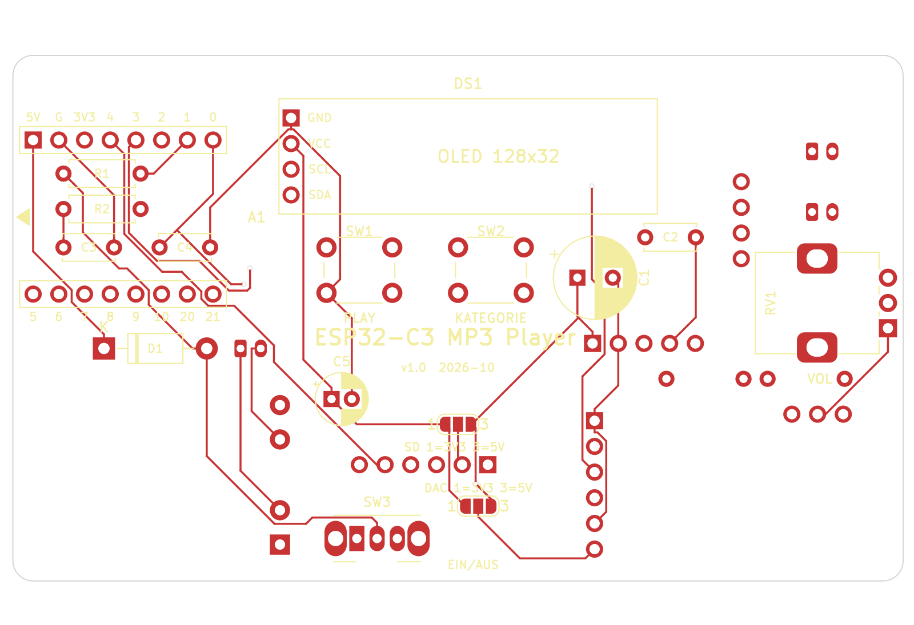
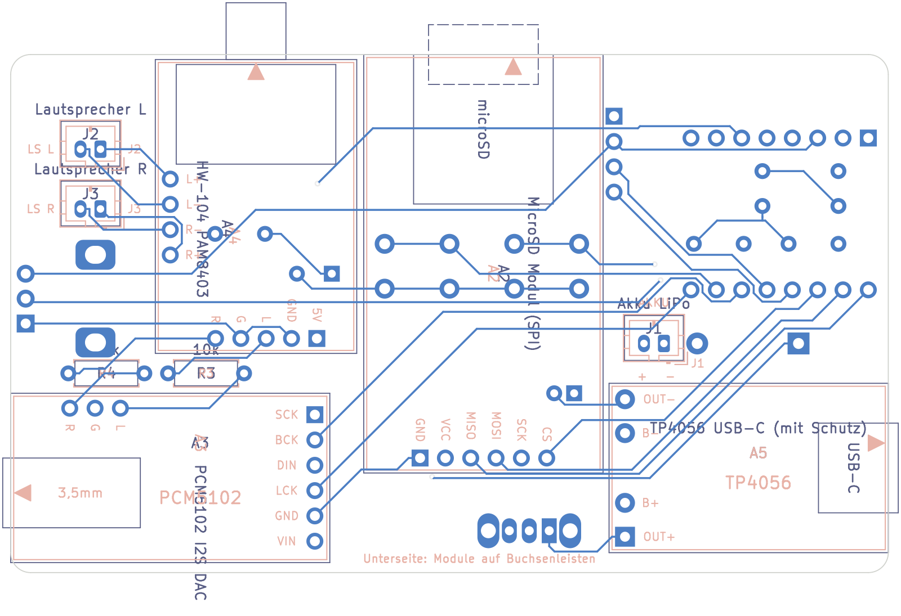

# Platine ESP32-C3 MP3 Player

KiCad-Projekt für eine doppelseitig bestückte Platine (88 × 52 mm, 2 Lagen). Alle Module
sitzen auf der Platine. Der ESP32-C3 SuperMini wird auf Buchsenleisten gesteckt.

> **Wichtig:** Die Maße und Pin-Positionen einiger Module sind geschätzt (siehe
> [Vor der Bestellung prüfen](#vor-der-bestellung-prüfen)). Bitte die Footprints mit den
> eigenen Modulen vergleichen und bei Bedarf in KiCad anpassen, bevor die Platine bestellt wird.

| Oberseite (Bedienseite) | Unterseite (von unten gesehen) |
|---|---|
|  |  |

Schaltplan: [Esp32C3Mp3Player-Schaltplan.pdf](Esp32C3Mp3Player-Schaltplan.pdf) bzw.
[bilder/schaltplan.png](bilder/schaltplan.png)

## Dateien

| Datei | Inhalt |
|---|---|
| `Esp32C3Mp3Player.kicad_pro` | KiCad-Projekt (Netzklassen: Signale 0,3 mm, Versorgung 0,6 mm) |
| `Esp32C3Mp3Player.kicad_sch` | Schaltplan |
| `Esp32C3Mp3Player.kicad_pcb` | Platine (geroutet, GND-Flächen auf beiden Lagen) |
| `Esp32C3Mp3Player.kicad_sym` | Symbole der Module |
| `Esp32C3Mp3Player.pretty/` | Footprints der Module |
| `fp-lib-table`, `sym-lib-table` | binden die beiden Projekt-Bibliotheken ein |

Erstellt mit KiCad 7.0. Die Dateien lassen sich mit KiCad 8 und 9 öffnen, beim Speichern werden
sie in das neue Format umgewandelt. Standardbauteile (Widerstände, Taster, ...) stammen aus den
KiCad-Standardbibliotheken.

## Aufbau

### Oberseite (Bedienseite)

| Ref | Bauteil | Lage |
|---|---|---|
| A1 | ESP32-C3 SuperMini auf 2 × Buchsenleiste 1×8 | links, USB-C an der linken Kante |
| DS1 | OLED 0,91" 128×32 | oben Mitte |
| SW1, SW2 | Taster 6×6 mm (Play/Next, Kategorie) | unter dem Display |
| RV1 | Poti 10k linear (9 mm, Alps RK09K o.ä.) | rechts |
| SW3 | Schiebeschalter Ein/Aus (C&K OS102011MA1Q, 2 mm Raster) | untere Kante, Hebel zeigt nach außen |
| R1, R2, C3, C4 | Spannungsteiler Akku, Filter-Kondensatoren | unter dem SuperMini |
| D1, C1, C2, C5 | Schottky-Diode, Elkos, 100 nF | freie Flächen |
| JP1, JP2 | Lötbrücken für die Versorgung von SD-Modul und DAC | Mitte unten |

### Unterseite

| Ref | Bauteil | Lage |
|---|---|---|
| A2 | MicroSD-Modul (SPI, 42 × 24 mm) | Mitte, Kartenschlitz an der oberen Kante |
| A3 | PCM5102 DAC | rechts unten, 3,5-mm-Klinke an der rechten Kante |
| A4 | HW-104 (PAM8403) | rechts oben, Poti-Achse an der oberen Kante |
| A5 | TP4056 USB-C Lademodul | links unten, USB-C an der linken Kante |
| J1 | Akku (JST-PH 2 mm) | links |
| J2, J3 | Lautsprecher links/rechts (JST-PH 2 mm) | rechts oben |
| R3, R4 | 10 k Vorwiderstände Audio | zwischen DAC und Verstärker |

Die Module auf der Unterseite werden ebenfalls auf **Buchsenleisten** gesteckt (8,5 mm hoch).
Dadurch ist genug Abstand zu den Lötstellen der Bauteile auf der Oberseite. Nur der **TP4056**
wird mit kurzen Stiftleisten-Pins direkt angelötet; unter ihm liegen deshalb keine Lötstellen.

## Schaltung

Die Pinbelegung des ESP32-C3 ist dieselbe wie in der [README](../README.md) und im Sketch:

| GPIO | Signal | GPIO | Signal |
|---|---|---|---|
| GPIO0 | Poti (Lautstärke) | GPIO6 | SD MOSI |
| GPIO1 | Akku-Messung | GPIO7 | SD CS |
| GPIO2 | I2S DIN → PCM5102 | GPIO8 | I²C SDA (OLED) |
| GPIO3 | Taster Play/Next | GPIO9 | I²C SCL (OLED) |
| GPIO4 | SD SCK | GPIO10 | I2S BCK → PCM5102 |
| GPIO5 | SD MISO | GPIO20 | Taster Kategorie |
| | | GPIO21 | I2S LCK → PCM5102 |

**Stromversorgung:** Akku (J1) → TP4056 (B+/B−) → OUT+ → Schalter SW3 → Schottky-Diode D1 →
5V-Pin des SuperMini. Geladen wird über die USB-C-Buchse des TP4056. Steckt USB am SuperMini,
läuft der Player über USB; D1 verhindert, dass dabei 5 V in den Akku zurückfließen. R1/R2 teilen
die Akkuspannung (hinter dem Schalter) für GPIO1. Ist der Schalter aus, misst die Firmware keinen
Akku und schaltet nicht ab.

**Audio:** PCM5102 L/R → R3/R4 (10 k) → Eingang HW-104 → Lautsprecher an J2/J3 (Brückenausgang:
L+/L− bzw. R+/R−, **nicht** mit GND verbinden). C1 (470 µF) und C2 (100 nF) sitzen direkt an der
Versorgung des Verstärkers, beide Lagen sind GND-Flächen. Das hilft gegen das Störgeräusch.
Ist es zu leise, R3/R4 durch Drahtbrücken ersetzen. SCK des PCM5102 liegt auf GND (interner Takt).

### Lötbrücken JP1 und JP2 (müssen geschlossen werden!)

Ohne Brücke bekommen SD-Modul bzw. DAC keinen Strom. Die mittlere Fläche (2) wird mit einer der
äußeren verbunden:

| Brücke | 1–2 (3,3 V) | 2–3 (5 V) |
|---|---|---|
| JP1 (SD-Modul) | SD-Modul ohne eigenen Spannungsregler | Catalex-Modul mit AMS1117-Regler |
| JP2 (PCM5102) | empfohlen | möglich (Modul hat eigene Regler) |

Hinweis zum Akkubetrieb: Am 5V-Pin liegen dann nur etwa 3,0 – 3,9 V (Akku minus Diode). Ein
SD-Modul mit AMS1117-Regler bekommt daran zu wenig Spannung. Für Akkubetrieb ein SD-Modul ohne
Regler an 3,3 V nehmen (JP1 auf 1–2).

## Stückliste

| Ref | Wert | Bauform / Footprint | Menge |
|---|---|---|---|
| A1 | ESP32-C3 SuperMini | + 2 × Buchsenleiste 1×8, 2,54 mm | 1 |
| DS1 | OLED 0,91" 128×32 I²C | + Buchsenleiste 1×4 | 1 |
| A2 | MicroSD-Modul SPI | + Buchsenleiste 1×6 | 1 |
| A3 | PCM5102 DAC | + Buchsenleisten 1×6 und 1×3 | 1 |
| A4 | HW-104 PAM8403 | + Buchsenleisten 1×5 und 1×4 | 1 |
| A5 | TP4056 USB-C mit Schutzschaltung | 4 einzelne Stiftleisten-Pins | 1 |
| SW1, SW2 | Taster | 6 × 6 mm THT | 2 |
| SW3 | Schiebeschalter 1×UM | C&K OS102011MA1Q (2 mm Raster, gewinkelt) | 1 |
| RV1 | 10 k linear | Alps RK09K stehend (9 mm) | 1 |
| R1, R2 | 100 k | 0207, Raster 7,62 mm | 2 |
| R3, R4 | 10 k | 0207, Raster 7,62 mm | 2 |
| C1 | 470 µF / 10 V | Elko radial 8 mm, Raster 3,5 mm | 1 |
| C5 | 100 µF / 10 V | Elko radial 5 mm, Raster 2 mm | 1 |
| C2, C3, C4 | 100 nF | Keramik, Raster 5 mm | 3 |
| D1 | 1N5817 | DO-41 | 1 |
| J1, J2, J3 | JST-PH 2-polig | B2B-PH-K, stehend | 3 |
| H1–H4 | Befestigungsloch M3 | | 4 |

## Bestückung

1. Lötbrücken JP1 und JP2 setzen (siehe oben).
2. Flache Bauteile auf der Oberseite: R1, R2, C3, C4 (unter dem SuperMini), D1, C2, C5.
3. Taster, Poti, Schiebeschalter, C1.
4. Buchsenleisten für SuperMini und OLED auf der Oberseite.
5. Unterseite: R3, R4, J1–J3, dann die Buchsenleisten für SD-Modul, PCM5102 und HW-104.
6. TP4056 mit kurzen Pins auf der Unterseite anlöten.
7. Module aufstecken.

Die Lötstellen der Buchsenleisten liegen jeweils auf der Gegenseite. Deshalb die Buchsenleisten
löten, bevor die Module aufgesteckt werden.

## Vor der Bestellung prüfen

Einige Datenblätter waren nicht erreichbar. Diese Angaben sind deshalb geschätzt:

| Modul | Annahme | Was prüfen |
|---|---|---|
| ESP32-C3 SuperMini | 22,52 × 18 mm, Reihenabstand 15,24 mm, Pin 1 (5V) 2 mm von der USB-Kante. Von oben, USB links: obere Reihe 5V, GND, 3V3, 4, 3, 2, 1, 0; untere Reihe 5, 6, 7, 8, 9, 10, 20, 21 | Reihenfolge der Pinreihen. Sind die Reihen vertauscht, lässt sich der SuperMini mit der Bauteilseite nach unten aufstecken (USB bleibt links). Besser: Footprint anpassen |
| OLED 0,91" | 38 × 12 mm, Pins GND, VCC, SCL, SDA | Bei manchen Modulen sind VCC und GND vertauscht! |
| MicroSD-Modul | 42 × 24 mm (Catalex-Bauform), Pins GND, VCC, MISO, MOSI, SCK, CS, 4 Löcher M2 | Pinreihenfolge und Lage der Befestigungslöcher |
| PCM5102 | 17 × 32 mm, Leiste SCK, BCK, DIN, LCK, GND, VIN an einer kurzen Seite, L/G/R an der langen Seite, Klinke an der anderen kurzen Seite | Größe und Lage aller Pins |
| HW-104 | 29,5 × 20,2 mm, Poti links; 5V, GND, L, G, R rechts; L+, L−, R−, R+ unten (Raster 2,54 mm) | am ungenauesten geschätzt – alle Pins prüfen |
| TP4056 | 28 × 17 mm, Pads OUT+, B+, B−, OUT− an der Schmalseite gegenüber USB-C | Abstand der Pads |
| Poti, Schalter, JST | Alps RK09K, C&K OS102011MA1Q, JST-PH | passen die eigenen Bauteile? Polarität des Akkusteckers (+ an Pin 1) |

**Footprint anpassen:** In KiCad den Footprint-Editor öffnen, Bibliothek `Esp32C3Mp3Player`,
Pads verschieben, speichern. Danach in der Platine *Werkzeuge → Footprints aus Bibliothek
aktualisieren* ausführen. Betroffene Leiterbahnen neu verlegen und die Flächen mit `B` neu
füllen. Anschließend den DRC laufen lassen.

**Bestellen:** *Datei → Fertigungsdateien → Gerber* (Lagen F/B.Cu, F/B.Mask, F/B.Silkscreen,
Edge.Cuts) und *Bohrdateien*. Die Mindestmaße (Leiterbahn 0,3 mm, Abstand 0,2 mm, Bohrung
0,4 mm) schafft jeder übliche Platinenhersteller.
